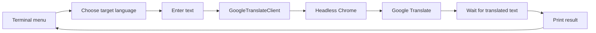

# Google Translate CLI 🌐

> A tiny 2020 Selenium project that turned Google Translate into a terminal workflow.


> [!NOTE]
> This is a historical learning project originally written in 2020. It is kept as a small automation time capsule. Google Translate is a changing web application, so its DOM and selectors may change independently of this repository.

## What was this?

The original idea was simple: choose a target language in the terminal, type some text, let Selenium open Google Translate in headless Chrome, and print the translated result back to the console.

The project supported nine target languages:

- Chinese (Traditional)
- English
- French
- German
- Spanish
- Russian
- Italian
- Korean
- Japanese

At the time, the repository also bundled a Windows `chromedriver.exe` so the script could launch Chrome without any external driver setup.

## Flow



## Structure after the refactor

```text
main.py
   ↓
TranslationCLI
   ↓
GoogleTranslateClient
   ↓
Selenium / Chrome
   ↓
Google Translate
```

The responsibilities are intentionally small:

- `main.py` — application entry point
- `translator.py` — language definitions, Selenium client, and CLI flow
- `selenium___.py` — compatibility launcher for the original script name
- `requirements.txt` — Python dependency declaration

## Running it

> [!WARNING]
> This repository demonstrates browser automation against the Google Translate web UI. It is not an official Google Translate API client, and live selectors may need maintenance when Google changes the page.

Install the dependency:

```bash
pip install -r requirements.txt
```

Run the modern entry point:

```bash
python main.py
```

The original command remains available for compatibility:

```bash
python selenium___.py
```

ChromeDriver no longer needs to be committed to the repository. Selenium 4 can use Selenium Manager to discover and manage the appropriate driver automatically.

## Then vs. now

The original version was very direct:

```text
global language dictionaries
        ↓
recursive input functions
        ↓
create Chrome inside translation()
        ↓
find_element_by_*
        ↓
manual chromedriver.exe
        ↓
os.close(0)
```

The refactor keeps the same tiny-project spirit but makes the lifecycle explicit:

```text
TranslationCLI
    ├── owns terminal flow
    └── uses GoogleTranslateClient
              ├── owns WebDriver
              ├── waits for elements
              └── always quits cleanly
```

A language choice now maps to Google Translate's target-language parameter (`tl`) instead of changing only the Google Translate interface language (`hl`).

## Why keep it?

Because it captures a very early automation instinct: **take a repetitive browser task and turn it into a small tool**.

The implementation was rough by modern standards, but the core idea is recognizable: wrap a UI workflow, provide a simpler interface, manage browser state, and return a useful result to the user.

## Historical limitations

- Google Translate is a dynamic web application; DOM selectors can change.
- This uses browser automation rather than an official translation API.
- There are no live integration tests against Google Translate.
- Headless Chrome still requires a working Chrome/Selenium environment.
- This project intentionally remains small instead of becoming a production translation service.
